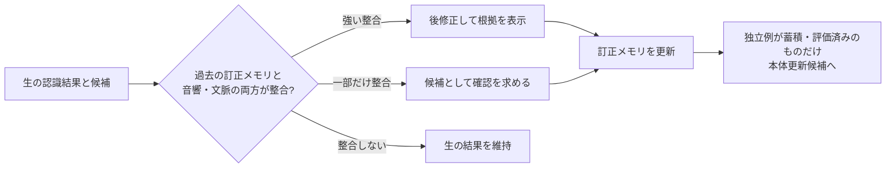

# 第15回：発明の芯候補――音声証拠付き訂正メモリ

2026-09-15。第14回の「即時後修正と周期的な本体更新」の案を、より具体的な発明仮説へ進める。ここでいう発明の芯候補は、新規性・進歩性・取得可能性の結論ではない。近い先行技術があるため、全項・非特許文献・審査経過の比較が必要である。

## 1. 何を変えるか

単なる用語辞書は「この表記が出たらその専門語に直す」に寄り、別の文脈や別の発音まで誤修正しやすい。提案する中心は、**専門語そのものではなく、専門語が特定の誤りとして現れる条件を記憶する**ことである。

仮称：**音声証拠付き訂正メモリ**。

訂正の一件ごとに、正しい表記だけでなく、元の誤認識、元音声の範囲、読み又は音素列、周囲の語、元のn-best／候補間の差、訂正操作の種類を結び付ける。次の発話では、用語が辞書にあるからではなく、今回の音声が保存済みの「誤りの型」に十分近い場合だけ、後修正候補を出す又は自動適用する。

## 2. なぜこれが重要か

この案が解く対象は「専門語を知らない」ことより、**同じ表記の登録が、無関係な発話まで上書きすること**である。例えば「抗生物質」が登録されていても、今回の音声がそれに近い証拠を持たなければ置換しない。専門語の頻度ではなく、音声上の混同関係と適用場面を判断材料にする。

後修正の安全性と、数か月後に本体更新へ送るデータの信頼性を、同じメモリで扱える点も重要である。後修正を一度したからといって教師データへ直行させず、独立した発話で再現し、評価を通った「誤りの型」だけを昇格させる。

## 3. 最小の処理案

| 段階 | 処理案 | 出力 |
|---|---|---|
| 訂正の受領 | チャット編集、候補選択、音声訂正のいずれかを受ける。文章編集との区別は未確定状態を許す | 訂正候補 |
| 音声の照合 | 訂正前後の語列を同じ元音声へそれぞれ対応付け、前後文脈・読み・候補列を比較する | 「元音声が訂正後を支持する度合い」 |
| メモリ登録 | 表記、読み、元の誤表記、音響上の混同関係、適用文脈、出所、状態を一件として保存 | 訂正メモリ項目 |
| 次回の後修正 | 今回の生結果・候補・音声表現・文脈が項目に整合するか判定する | 自動修正／提案／何もしない |
| バックエンド昇格 | 独立発話での再現、誤修正の評価、範囲を満たす項目群だけを候補化 | 更新候補群 |

「整合」の具体式は未決定。少なくとも、文字列の類似だけ、LLMが専門語を知っているだけ、訂正回数だけのいずれか一つでは自動修正にしない、という制約が候補になる。

## 4. 近い先行技術との境界

| 近い文献 | 既に確認した内容 | この案で比較を要する差 |
|---|---|---|
| [JP2025135075A](https://patents.google.com/patent/JP2025135075A/en)、公開1・2・4～8 | 固有語彙と認識結果をLLM・プロンプトへ渡して後修正。修正要否の問い合わせも含む | 固有語彙による修正と、過去の訂正に由来する音響的混同条件での限定を同じとしない。全項比較未了 |
| [JP4657736B2](https://patents.google.com/patent/JP4657736B2/en)、登録1・3・8～11 | 訂正／編集を推論し、文脈語で強制整列、距離や信頼性を利用して選択的に学習 | 一件の訂正の選別と、後続発話で同じ誤りの型だけへ後修正を適用し、本体更新候補も統制する処理を比較する。差の有無は未判定 |
| [JP5366169B2](https://patents.google.com/patent/JP5366169B2/ja)、登録1 | 訂正語の時間区間から音素列を取り、発音・新語を辞書へ追加 | 音素・時間対応の取得と、次回の後修正を音響的混同条件で制御することは別。組合せの既知性未確認 |
| [US10522133B2](https://patents.google.com/patent/US10522133B2/en)、登録1・3～5 | 過去の訂正を履歴化し、n-best・信頼度に応じて履歴への追加／自動訂正／提案を扱う | 既にn-bestを使うため重要な海外例。音声対応・読み・出所独立性・本体更新への昇格までを一体で扱う差があるか精査が必要 |
| [US8019602B2](https://patents.google.com/patent/US8019602)、対応日本例JP4657736B2 | 訂正後語と波形を強制整列し、発音格子・信頼度・反復で選択的に学習 | アラインメントと反復自体を発明の中核に置けない。日本・米国の請求項差にも注意 |

この比較から、単に「LLM＋アラインメント＋n-best＋定期学習」を束ねる案は弱い。必要なのは、どの音声証拠を保存し、後修正と本体更新のどちらにどの条件で使い、誤修正をどう抑えるかを具体的に固定すること。

## 5. さらに尖らせる三案

### A. 反実仮想照合カード

同じ元音声について、認識前の語列と訂正後の語列をそれぞれ対応付ける。訂正後だけが優勢で、かつ周囲文脈と混同型が一致した場合に「音声に支持された訂正」とする。人が文章を読みやすく直しただけの編集は、音声支持が弱ければ後修正用にも学習用にも昇格しない。

効果仮説：ユーザーの文章編集を誤教師とする率を下げる。強制整列・信頼度の既知性が高いため、二つの反実仮想の比較内容、判断時の情報、出力後の扱いを精査する必要がある。

### B. 誤り型の局所適用

一つの専門語を広く注入せず、「誤表記→正表記」「読みの近さ」「前後文脈」「候補の差」が近い発話にだけ適用する。整合が弱いときは置換せず、候補提示へ落とす。記憶する単位を語ではなく誤り型にする。

効果仮説：専門語の再現率を保ちつつ、別場面での過剰置換を減らす。US10522133B2の履歴・n-best処理との詳細比較が最優先。

### C. 訂正の二段階昇格

一件目は後修正の候補にしか使わず、独立した元音声で再現し、かつ評価用音声で副作用が小さい場合だけ本体更新候補にする。派生した合成例は独立例の数に数えない。撤回時はその項目に由来する後修正と更新候補を同時に追跡する。

効果仮説：速い利用と遅い更新の間に、誤教師をためない関門を置ける。周期分離CN114078475B、訂正保存US8352264B2、原因追跡／学習解除の周辺文献との比較が必要。

## 6. 一番有望な焦点

現時点では、**AとBを組み、Cで本体更新を統制する**案が最も具体的である。言い換えると、

> 人の訂正を、同じ音声に対する訂正前後の照合と過去の誤り型との整合で評価し、強いものだけを同型の後続発話へ局所適用し、独立例・副作用評価を満たしたものだけをバックエンド更新へ昇格する。

これが直ちに特許になるとはいえない。しかし、UI操作名やモデル更新周期より、課題・判断・効果を一続きで説明できる。次は、この一文を要素に分解して日本・海外の独立請求項と一項ずつ照合する。
