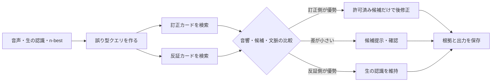

# 第16回：訂正メモリを検索する「反証RAG」

2026-09-15。ユーザー提案「誤り訂正時にRAG」を、第15回の音声証拠付き訂正メモリへ接続する。発明仮説であり、特許性は未判定。

## 1. RAGをどこに使うか

RAGの役割は、外部文書から専門語を見つけてLLMに自由な書き換えをさせることではない。**今回の誤認識が、過去のどの訂正・どの非訂正例に似ているかを検索し、修正の可否を制御すること**に置く。

仮称：**反証RAGによる訂正ゲート**。

## 2. 検索対象を三種類に分ける

| カード | 持つ情報 | 検索する目的 |
|---|---|---|
| 用語カード | 表記、読み、適用範囲、承認者、出典文書 | 専門語の正しい候補を出す |
| 訂正カード | 生の誤表記、訂正後表記、元音声の区間、読み／音素、n-best、前後文脈、訂正方法、確定状態 | 同じ誤り型を見つける |
| 反証カード | 類似の生結果・文脈だが、訂正しなかった例、別の語へ訂正した例、編集扱いとした例 | 過剰な置換を止める |

検索クエリも、認識テキストだけにしない。生の認識語、n-best差、音声区間からの読み又は音響表現、周辺の会話、話者・部署・時期を使う。実装上、これらを一つの埋め込みに混ぜる必要はなく、候補検索後に音響・文脈を別々に再順位付けしてよい。

## 3. LLMの役割を狭める

LLMには「もっともらしい専門語を生成する」役ではなく、検索されたカードを読んで次の三択だけを返す役を与える。

1. **修正**：取得済みの訂正カード又は用語カードにある表記だけへ置換する。
2. **提案**：候補を表示して人に選ばせる。
3. **維持**：生の認識結果を変更しない。

LLMの出力には、使ったカードIDと変更した範囲を必須にする。実行部は、カードにない表記、音声区間外への変更、後処理対象外の変更を拒否する。これにより、プロンプトだけで用語を注入して生じる幻覚的な置換を減らすことを狙う。

## 4. 近い先行技術との比較

| 文献 | 近い部分 | この案で精査する点 |
|---|---|---|
| [CN119296516B](https://patents.google.com/patent/CN119296516B/en) | 分野文書をRAG化し、ASR結果で検索し、取得した文書・ホットワードを文脈として再認識に用いる | 文書RAGによる専門語補強は既知。訂正履歴と反証履歴を、音声の誤り型で対に検索して後修正を許可・抑止する構成との差を確認する。Googleの国別対応表はCNのみ |
| [JP2025135075A](https://patents.google.com/patent/JP2025135075A/en) | 固有語彙と認識結果をLLM・プロンプトへ渡して後修正する | RAGの有無だけで区別しない。検索根拠の構造、反証の使用、出力制限、音声との照合を請求項単位で比較する |
| [US10522133B2](https://patents.google.com/patent/US10522133B2/en) | 訂正履歴を参照し、n-best・信頼度で自動修正・提案・維持を分ける | 履歴検索は近い。RAGと称するだけでは差にならない。訂正カードと反証カードの対検索、音声証拠での再順位付け、カードIDに縛る出力を精査する |
| [US8762156B2](https://patents.google.com/patent/US8762156B2/en) | 文脈とデータベース照会からトークンを修復する複数のインタープリタ | 外部DB・文脈修復も既知。反証により不適用を決める点と、訂正根拠を更新候補まで追う点の既知性は未確認 |

以上から、「RAGで専門用語を検索して後修正」は単独では弱い。CN119296516Bは、分野文書のRAG、ASR結果での検索、ホットワードを使った再認識まで含む。JP2025135075Aは、固有語彙とプロンプトによる日本の後修正例である。

## 5. 効果仮説と反証試験

狙う効果は、専門語の修正率だけではない。

| 確認したい効果 | 比較 | 失敗と判定する例 |
|---|---|---|
| 専門語の正しい修正 | 用語カードだけのRAGと、訂正＋反証カードRAG | 修正率が上がらない |
| 一般語・別場面への誤置換抑制 | 同じ候補集合で比較 | 反証カードを入れても誤置換が減らない |
| 人の確認負担 | 常に確認する方式と、三択ゲート | 自動修正を減らしただけで確認要求が過大になる |
| 後日の本体更新の品質 | 無選別の訂正群と、訂正カード群 | 評価音声で本体更新が悪化する |

同じ元音声の派生例やコピーされた文書を、独立した反証・正例として数えない。LLMがカードにない表記を出しても、実行部が受け付けない試験を含める。

## 6. 次に掘る一点

この案を特許候補として追う場合、最初に固定するべきは「反証カード」の定義である。例えば、同じ生の誤表記でも、音声上の読みが異なる例、前後の語が異なる例、人が文章編集と明示した例をどう記録し、検索順位にどう使うか。ここが単なる用語RAGとの実質的な差になる可能性がある。
