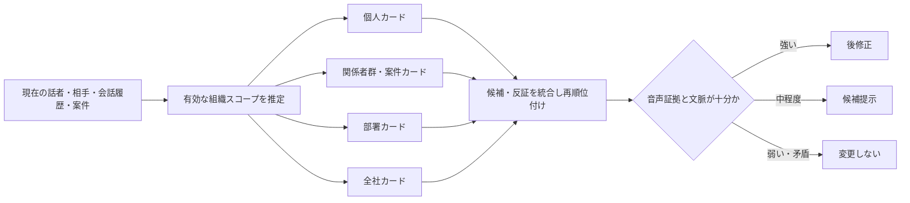

# 第17回：個人・部署・会話場面で訂正カードを選ぶRAG

2026-09-15。ユーザー発案「音声対話UIでは、その人がよく使う言葉を引っ掛かりやすくする。部署も判断対象のカードに入れる」を調査・具体化する。以下は発明仮説であり、特許性・有効性の結論ではない。

> **訂正（同日）**：ユーザーから「範囲で除くと他人の訂正が反映されない」と指摘を受けた。このメモの「組織スコープで候補を除外する」発想は採用しない。アクセス権に関する制約を除き、訂正カードは全員分を共有したまま、部署・個人・対話状況は**順位付けの弱い根拠**としてのみ用いる。後続の[第18回](2026-09-15_18_correction-transfer-rag.md)が置換案である。

## 1. 結論

部署は重要だが、固定の「部署辞書」を引くだけでは弱い。個人辞書・共有辞書、組織情報や役職を用いる音声認識関連技術はすでにある。狙うべきは、**現在の音声対話の相手・案件・会話の流れから有効な組織範囲を推定し、その範囲ごとに訂正カードを検索、適用、昇格、失効させること**である。

仮称：**対話状況連動の組織スコープRAG**。

## 2. カードに入れる情報

「部署名」をLLMへの自然言語の一文として渡すだけではなく、カードごとに適用範囲と根拠を持たせる。

| カードの項目 | 例 | 役割 |
|---|---|---|
| 正しい表記・読み・誤り型 | 「KPI」、ケーピーアイ、"KPA"→"KPI" | 訂正候補を特定する |
| 所有範囲 | 個人、二者の会話、案件、チーム、部署、全社 | どの利用者・場面で検索可能か決める |
| 対話状況 | 話者、相手、会議、表示中資料、案件、会話の直前語 | 現在の有効範囲との整合を測る |
| 音声証拠 | 音声区間、読み・音素、n-best、訂正前後の照合結果 | 文字だけの偶然一致を防ぐ |
| 反証・例外 | 同じ略語でも別の部署では別の語、文章編集と判定した例 | 過剰置換を止める |
| 昇格・失効情報 | 承認者、独立例数、評価結果、組織変更日、期限 | 個人の癖を全社標準へ誤って広げない |

個人がよく使う言葉は、個人スコープで候補順位を上げる。ただし、出現回数だけで自動修正を許可しない。音声証拠・会話状況・反証カードがそろうかで、修正／提案／維持を選ぶ。

## 3. カードの流れを「昇格」として扱う

1. 人の訂正はまず**個人カード**として登録する。
2. 同じ案件や同じ会話相手との独立した発話で裏付けられた場合に、**関係者群・案件カード**へ昇格する。
3. 部署内の別話者・別会話でも誤修正が少ないと評価できた場合に、**部署カード**へ昇格する。
4. 全社用語へ広げるには、部門間の意味・読みの衝突がないことを確認する。
5. 異動・案件終了・用語変更後は、範囲縮小、失効、又は反証カード化する。

ここでいう「独立」は、同じ録音の再生、同じ文書のコピー、合成派生音声を別例として数えないことを含む。部署をまたぐほど必要な根拠を増やす設計なら、個人の癖と組織語を混ぜにくい。

## 4. LLMとフィルタの分担

**前段フィルタ**は、利用者の権限又は失効済みカードだけを扱う。部署・案件・会話相手との距離を理由に訂正カードを除外しない。これは再現可能な規則で実装する。

**RAG**で、全員の訂正カードと反証カードから、誤り型・音声証拠・会話文脈が近いものを取得し、部署・案件・個人との関係は順位付けの一要素にする。

**LLM**は、取得カードを基に修正・提案・維持を選ぶ。ただし、カード内にある表記、読み、変更範囲だけを出力できるよう制約する。

**後段検証**で、LLMが引用したカードID、適用範囲、音声区間を確認し、範囲外の置換を拒否する。

この分担により、「LLMが部署情報を読んでそれらしく判断した」ことを、監査できる根拠と区別できる。

## 5. 確認した近い先行技術

| 文献 | 確認したこと | 今回の案との差として精査すべきこと |
|---|---|---|
| [JP2018040906A](https://patents.google.com/patent/JP2018040906A/ja) | ユーザーごとの単語辞書、複数ユーザーの共有辞書、音声・認識結果・修正結果の保存 | 個人／共有辞書自体は既知。対話状況でスコープを選び、カードを昇格・失効させる処理とは分けて比較する |
| [JP2021131417A](https://patents.google.com/patent/JP2021131417A/ja) | 所属・組織パス・役職を辞書に持ち、音声認識結果から人物候補を絞る。組織上位までの一致も記載 | 人物特定が主題であり訂正RAGではない。ただし所属範囲で候補を絞る考え方は近い |
| [JP2025135075A](https://patents.google.com/patent/JP2025135075A/en) | ユーザーに関連付けられた固有語彙と認識結果をLLM・プロンプトへ渡して後修正 | 固有語彙の個人化だけでは不足。組織スコープ・反証・昇格・出力制約を全項と比較する |
| [JP5474723B2](https://patents.google.com/patent/JP5474723B2/en) | 共通辞書、個人辞書、指定文書・訂正・メールによる個人辞書適応の従来技術を整理 | 個人に適応した語彙は古くから存在する。個人頻度の利用だけを固有点としない |
| [JP6675078B2](https://patents.google.com/patent/JP6675078B2/en)／公開JP2017167247A | 発話内容に応じ、複数の誤認識訂正処理方法から選択 | 発話内容で方法を選ぶ点は近い。組織範囲別のカード検索・適用の詳細を比較する |

公式現況は、今回新たに確認していない。Google表示を公式の権利状態として扱わない。

## 6. 効果を確かめる試験

同じ略語・同音語が複数部署で違う意味を持つデータを用意する。次を比較する。

| 比較 | 主な測定 |
|---|---|
| 全社用語カードだけ | 専門語正答、他部署の誤置換 |
| 個人頻度を一律に加重 | 個人の再現率、個人の一時的な誤りの固定化 |
| 固定の部署カード | 部署内正答、案件が変わった後の誤置換 |
| 提案する組織スコープRAG | 正答、誤置換、確認要求数、個人→部署昇格後の悪化、失効後の残存誤り |

部署ラベルを付けただけで改善しない場合、提案の効果仮説は支持されない。個人・部署・案件のどの情報が効いたかを分けて評価する。

## 7. 現時点で一番よい一文化

> 音声対話における利用者、相手、案件及び会話履歴から有効な組織スコープを推定し、当該スコープに対応する訂正カード及び反証カードを、音声上の誤り型とともに検索し、カードの適用範囲と音声証拠に基づいて認識結果の修正、候補提示又は維持を決定し、訂正カードを独立した利用実績と副作用評価に応じてより広い組織スコープへ昇格させる。

この一文を、次の段階で要素分解して独立請求項と照合する。特に、カードの昇格・失効と、反証カードをどこまで具体的に定義できるかが核心になる。
