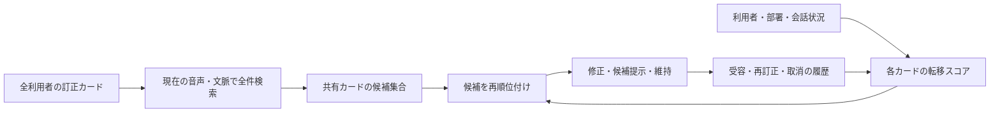

# 第18回：訂正が「この人に効くか」を学ぶ共有RAG

2026-09-15。第17回へのユーザー指摘を反映した置換案。全員の訂正を共有し、部署や個人の属性でカードを排除しない。以下は発明仮説であり、特許性・有効性の結論ではない。

## 1. 一つのアイデア

仮称：**訂正転移RAG**。

人が行った「誤認識表記→正表記」の訂正カードを全利用者で検索可能にする。ただし「よく使われた語」や「同じ部署」を理由に直ちに強く適用しない。各カードについて、**そのカードを提示又は適用した後に、現在の利用者が受け入れたか、別の表記へ再訂正したか、取消したか**を記録し、次回以後にその利用者へ当該カードが効く確率を順位へ反映する。

言い換えると、学ぶ対象は単語の人気ではなく、**ある他人の訂正が、ある利用者に転移して役立つか**である。部署は、その確率を初期化又は補助する特徴量の一つにとどめる。

## 2. 具体的な最小構成

1. ASR結果の一部に対して、音声区間、読み、n-best、前後文脈をキーに、全員の訂正カードを検索する。
2. 各カードには、訂正前後、音声上の根拠、作成者、作成時の会話状況に加え、後の利用者ごとの**受容・再訂正・取消**の結果を紐付ける。
3. 現在の利用者に対し、音声類似度・文脈類似度と、「類似した利用者／部署／会話でこのカードが受容され、再訂正されなかった度合い」を合わせて再順位付けする。
4. 高い場合だけ後修正し、中程度は候補として示し、低い又は反証が強い場合は維持する。
5. 利用者が候補を受け入れれば正の根拠、別表記へ直せば負の根拠、取消せば適用失敗の根拠として、**そのカードからその利用者への転移スコア**を更新する。カード自体は削除しない。

例：Aさんが「エスエルエー」を「SLA」に直したカードがある。Bさんの発話でも音声・文脈が近ければ候補に出る。Bさんが受け入れればBさんへの転移根拠になる。Bさんが「SRA」へ直せば、カードは全員に残したまま、Bさんの次回順位だけ下げる。

## 3. なぜこの形に絞るか

「個人用語彙」「同じ部署の語彙」「共有訂正」「候補順位付け」はそれぞれ既知性が強い。とくに、[US8532994B2](https://patents.google.com/patent/US8532994B2/en)は本人とソーシャルグラフ上の他者の語彙から個人向け言語モデルを作ることを記載し、[JP6488588B2](https://patents.google.com/patent/JP6488588B2/ja)もソーシャルグラフのデータを連絡先語彙に使う。そのため「部署・関係者の語を使う」だけを発明の中心にするのは避けるべきである。

本案の狙いは、共有カードの**内容**又は作成者との近さではなく、カードを適用した結果として生じる**利用者別の受容・再訂正・取消という反応**を、次の共有カード検索順位の根拠にする一点である。

## 4. 確認した近い先行技術と、残る比較点

| 文献 | 公開・請求項等で確認した範囲 | 本案と比較すべき一点 |
|---|---|---|
| [US8204739B2](https://patents.google.com/patent/US8204739B2/en) | フィールドでの訂正・新語を利用者コミュニティ全体で集約・共有し、訂正に応じて言語モデル等の確率を調整することを記載 | 共有訂正・確率調整は既知。本案の利用者別「転移結果」をカード順位に使う部分を請求項単位で照合する必要がある |
| [US9858038B2](https://patents.google.com/patent/US9858038B2/en) | 集約した利用者置換データと利用者固有の置換データを訂正候補リストに使い、過去訂正等で話者依存に適応することを記載 | 共有＋個人の候補順位は近い。受容後の再訂正・取消を、共有カードごとの転移可能性として更新する構成が開示又は自明かを精査する必要がある |
| [US20190035385A1](https://patents.google.com/patent/US20190035385A1) | 表示した文字列への正誤入力、訂正、n-best選択、訂正結果による認識精度改善を記載。Googleの表示では当該出願は放棄 | 受容／否定の取得自体は既知。本案は再訂正・取消を「カード→利用者」の転移失敗として次回RAG順位に使う点を検証対象とする |
| [US20200105247A1](https://patents.google.com/patent/US20200105247A1/en) | クエリ集合からの訂正候補を人気度で順位付けし、音声との音韻類似度で再順位付け | 候補再順位付け自体は既知。人気度・音韻距離ではなく、利用者別の訂正受容結果を用いる点の相違を精査する |
| [JP2025135075A](https://patents.google.com/patent/JP2025135075A/en) | 利用者に関連付けた固有語彙とASR結果をLLMへ渡し、後修正を得る | 個人語彙＋LLM後修正は既知。全員の訂正カードを残した転移スコアRAGとは全項比較が必要 |

**未確認の重要点**：今回の検索では、「共有されたASR訂正カードについて、利用者ごとの受容・再訂正・取消を転移可能性の推定値として保持し、その値で次回の検索順位を変える」ことを正面から請求する文献は見つけていない。ただし、検索は網羅的ではなく、上表の共有訂正・個人化・候補再順位付けの組合せから容易に想到されるかも未評価である。したがって、これを特許の空白又は権利化可能性とは扱わない。

## 5. 最初に試す比較

| 比較対象 | 検証したいこと |
|---|---|
| 全利用者の訂正頻度だけで順位付け | 多数派の訂正が別の利用者で誤置換を起こす頻度 |
| 個人の頻度だけで順位付け | 新しい利用者へ有用な他人の訂正が届かない頻度 |
| 部署でハードに絞る | 他部署の有用訂正を落とす頻度 |
| 訂正転移RAG | 全カードを残したまま、正答・誤置換・再訂正・取消を改善できるか |

効果は「専門語の正答率」だけでなく、他人の訂正を誤適用して利用者が再訂正する率、および候補を出しても受け入れられない率で測る。

## 6. 一文化

> 音声認識結果の訂正カードを複数利用者で共有して検索し、各訂正カードの適用後における利用者ごとの受容、異なる表記への再訂正又は取消の結果を、当該訂正カードが当該利用者へ転移して有効である度合いとして記憶し、現在の音声及び文脈との一致度と当該度合いに基づいて訂正カードを再順位付けし、認識結果の修正、候補提示又は維持を決定する。

次段階では、この一文の各要素を日本公報の請求項で再検索し、US9858038B2・US8204739B2・US10522133B2・JP2025135075Aとのクレームチャートを作る。
