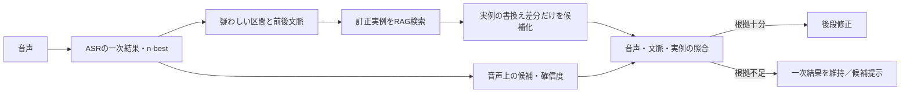

# 第19回：過去の訂正実例に根拠を限定する後段修正

2026-09-15。ユーザーの「後段修正をRAGで絞り込み、文脈や以前の書換え例を参照する」案を、調査の中心案として記録する。以下は発明仮説であり、特許性・有効性の結論ではない。

## 1. 結論

これは**製品設計としてまず採るべき本体案**である。個人化、部署、モデル再学習は必須要素ではない。

> ASRの一次結果から誤りそうな区間を定め、その区間と前後文脈を問い合わせとして、過去の人手訂正実例を検索する。各実例は「訂正前のASR表記、訂正後の確定表記、訂正時の文脈、音声上の根拠」を持つ。後段処理は、検索した実例の訂正差分を候補にして音声・文脈と照合し、根拠が足りなければ一次結果を維持する。

RAGは文章を自由に生成する装置ではない。**過去の書換え実例を根拠にして、今回許される置換候補を絞る装置**である。

## 2. 最小のデータ単位

訂正実例を、単語辞書ではなく次の一件として保存する。

| 項目 | 例 |
|---|---|
| 一次結果の該当区間 | `サービス レベル 合意` |
| 確定表記 | `SLA` |
| 書換え差分 | `サービス レベル 合意 → SLA` |
| 前後文脈 | `今月の___は…` |
| 音声根拠 | 対応区間、読み、n-best又は格子の候補、信頼度 |
| 利用結果 | 人手訂正、候補選択、後の取消等 |

新しい発話で `サービス レベル 合意` が出た時、似た文脈の実例を検索する。出力候補はその実例の `SLA` に限定し、音声上も「エスエルエー」と矛盾しない場合だけ置換する。検索実例が弱い、又は音声と矛盾する場合は置換しない。

このため、他人の訂正はすべて共有できる。部署・話者・案件は検索順位を補助してもよいが、カードを除外する要件にはしない。

## 3. 先行技術から見た位置付け

| 文献 | 確認した範囲 | 本案への意味 |
|---|---|---|
| [US20260011325A1](https://patents.google.com/patent/US20260011325A1/en) | ASR仮説と文脈リストから、元ASRモデルを変えずに文脈依存スペル訂正を行う。仮説・文脈リストのフィルタも記載 | **後段の文脈訂正**は非常に近い。単に「RAGで専門語リストを絞って後修正」では差になりにくい |
| [JP2025135075A](https://patents.google.com/patent/JP2025135075A/en) | 利用者関連の固有語彙とASR結果をLLMへ渡し後修正 | LLMに語彙を渡すだけでは不足 |
| [WO2006113350A2](https://patents.google.com/patent/WO2006113350A2/en) | ASR出力と最終編集文書の対を比較し、頻出する誤り・不一致を自動訂正モデルへ適応 | 過去の訂正対から後続文書を直す考えは既知。実例を都度検索し、その差分を今回の許容候補に制限する構成と比較が必要 |
| [US9858038B2](https://patents.google.com/patent/US9858038B2/en) | 集約利用者置換データと個人置換データを訂正候補に利用 | 訂正履歴を候補源にする点が近い。実例の文脈・音声根拠を束ね、引用実例の差分だけを許す構成と全項比較が必要 |
| [JP2008243080A](https://patents.google.com/patent/JP2008243080A/ja) | 類似する用例を検索し、差異語句と音韻・意味属性を用いて音声翻訳の認識誤りを訂正 | 用例検索による訂正は古い。翻訳用の対訳コーパスではなく、人手訂正実例を根拠単位として用いる点だけでは足りず、具体的な照合・出力制約を検討する必要がある |
| [JP7771015B2](https://patents.google.com/patent/JP7771015B2/ja)（公開JP2024015818A） | 実施形態は、認識結果・ユーザ修正後結果・話題・修正時刻を修正履歴として保存し、修正前後の差分文字列を用いて訂正モデルを更新。登録請求項3～11は後段訂正モデル、潜在表現に基づく経路探索、時刻・話題の重み、修正履歴によるモデル更新を含む | **最も近い日本文献**。ただし独立請求項1は話題別言語モデルと表示であり、訂正モデルは請求項3以下の従属項。RAGで実例を都度取得し、引用実例の差分以外を実行部が拒否し、現在の音声根拠で適用を止める構成が、同文献の訂正変換器・更新とどう異なるかを請求項ごとに比較する必要がある |

**調査上の判断**：この案を「特許の空白」とは呼べない。後段訂正、文脈利用、過去の訂正対、類似用例の検索はいずれも先行例があり、特にJP7771015B2の実施形態は修正履歴・差分文字列・話題／時刻を使う後段訂正に近い。一方で、実装の中心としては明快であり、次に精査すべき対象も明確になる。

## 4. 特許を検討するなら、曖昧にしない点

特許検討の対象を「RAGで後修正する」と広く書かない。少なくとも次を固定して、各要素が既知かを調べる。

1. 検索単位を、単語ではなく**人手訂正前後の対とその音声対応区間**にする。
2. 検索結果から取り出せる候補を、実例の**書換え差分**に限定する。
3. 現在の音声のn-best、格子又は音声埋込みと照合できない差分は自動適用しない。
4. LLMを使う場合も、引用した実例ID・対象区間・差分を返させ、実例にない表記の生成を実行部が拒否する。

この4点をまとめても新規性・進歩性があるとは未判断である。しかし、少なくとも「何を比較すべきか」が明確になる。

## 5. 次の調査

日本を中心に、上表の各文献の請求項と、次の組合せを検索する。

- ASR訂正前後の対を検索単位にすること
- その対の音声区間・n-best・格子を検索又は適用の根拠にすること
- 検索実例の書換え差分以外の生成を禁止すること
- 修正、候補提示、維持を根拠強度で切り替えること

第18回の「訂正転移RAG」は、ここでの訂正実例を後から順位付けする補助案に下げる。中心案ではない。
