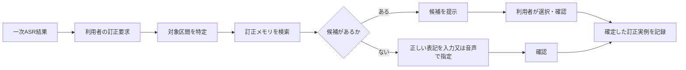

# 第20回：明示的な訂正要求を起点にする検索・選択・登録ループ

2026-09-15。ユーザー案「音声認識が間違っているという発話を認識した時だけ検索し、候補選択。見つからなければ記録してもらう」を整理する。以下は事実と設計仮説を分けたメモであり、特許性の結論ではない。

## 1. 製品としての結論

この流れを採るのがよい。ASRの怪しい箇所を常時探したり、全発話へRAGを走らせたりしない。利用者が「違う」「訂正」「今の語は…」と発話する、又は画面の認識結果を選択・編集する、という**明示的な訂正要求**だけを入口にする。

検索の問い合わせは、対象区間の一次ASR表記、訂正要求発話の候補列、前後の対話文脈を併用する。候補がなければ利用者が正しい表記を一度だけ確定し、`訂正前ASR表記→確定表記` と文脈を新規実例として記録する。次回からその実例が候補になる。

ここでは、候補選択であっても新規入力であっても、確定後の一件を同じ訂正メモリへ記録する。共有するか、利用者内だけに留めるかは、記録後の配布方針であり、検索の入口とは別に扱う。

## 2. 特許調査で確認した近い例

| 文献 | 確認した内容 | 今回の案への意味 |
|---|---|---|
| [US10522133B2](https://patents.google.com/patent/US10522133B2/en) | 請求項1は、利用者の過去の誤認識とその訂正情報の履歴から、現在のテキスト区間が誤認識に当たるか判定し、訂正又は警告を決める | 訂正履歴を引いて自動訂正／警告する中心部が近い |
| [US9514743B2](https://patents.google.com/patent/US9514743B2/en) | 訂正要求を含む音声クエリを判定し、第一音声クエリの認識誤りに候補n-gramを置換して候補訂正クエリを作る。訂正要求側の複数仮説も候補生成に使う | 「訂正発話を入口に候補を作る」点が近い |
| [JP3718088B2](https://patents.google.com/patent/JP3718088B2/ja) | 第1音声の認識結果と訂正用音声から複数修正候補を生成・通知し、利用者選択で認識結果を直す。選択結果で辞書を更新する従属請求項もある | 訂正用音声→候補選択→更新は既知 |
| [JP4537755B2](https://patents.google.com/patent/JP4537755B2/ja) | 対話履歴から訂正発話を認識するルールを生成し、訂正発話と直前発話の認識候補を使って訂正する | 訂正発話の検出と直前発話への適用も既知 |
| [US9858038B2](https://patents.google.com/patent/US9858038B2/en) | 利用者が訂正部分を選び、複数のデータ源から得た候補リストを提示して選択・置換。集約利用者置換データと個人置換データを使用可能 | 共有履歴から候補を出す点が近い |

## 3. 調査上の判断

「訂正要求を検出→候補検索・選択→候補なしなら新規登録→次回利用」という一連の目的だけを、特許の空白とは扱えない。候補提示、訂正音声、訂正履歴、辞書更新は上記先行例にある。

それでもこの流れは、現在のシステムを設計する土台として有効である。特許検討を続けるなら、候補の出し方・確定実例のデータ構造・音声との照合・共有する実例の品質管理などを、先行例の請求項と分けて探す必要がある。

## 4. 最小実装の記録単位

| 項目 | 用途 |
|---|---|
| 対象となる一次ASR区間 | 何を直したかを特定 |
| 利用者の訂正要求とその候補列 | 「違う」と正しい語の指定を区別し、音声指定の誤認識に備える |
| 確定表記 | 次回の候補 |
| 前後文脈 | 同音語の混同を抑える |
| 現音声との対応情報 | 後段で誤った置換を止める根拠 |
| 選択か新規入力か、確認結果 | 実例の信頼度 |

「候補なし」では、正しい表記の入力欄を最初に示す。音声だけで記録する場合も、最終表記は画面で確認して確定する。ここで確定した表記を、そのまま将来の自動置換に使わず、初回は候補提示用にするのが安全である。
