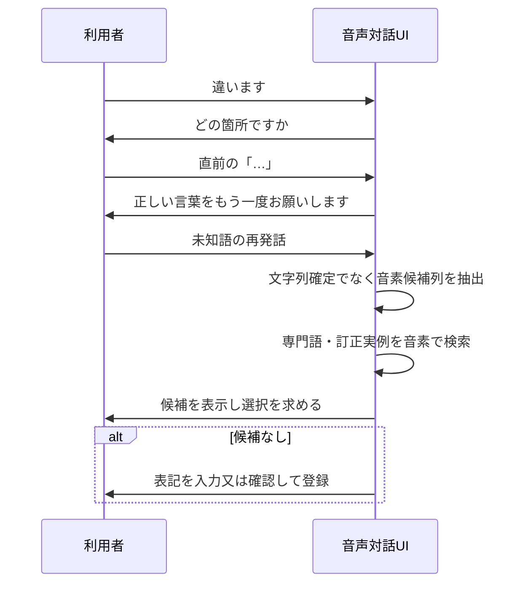

# 第21回：対象指示と未知語の音を分ける訂正対話

2026-09-15。ユーザー案「訂正対象区間を聞き、その応答から未知語の音素を推定して検索・候補提示し、なければ記録」を整理する。以下は発明仮説であり、特許性・有効性の結論ではない。

## 1. 一つの対話としての形

仮称：**指示・音分離型訂正対話**。

誤認識を直す利用者の発話には、通常、二つの意味が混ざる。

1. どの表示区間を直すか
2. 正しい語は何か

これを一発話から同時に解こうとせず、別ターンにする。

第1ターンで対象区間を確定するので、第2ターンの音声は「正しい語を表す短い音声」として扱える。第2ターンを無理に完全な文字列へ変換しない。音素列（又は音素候補格子）を用いて、専門語辞書と過去訂正実例を検索し、候補を出す。

## 2. 検索の実装イメージ

専門語・訂正実例には、表記だけでなく読みの音素列を保持する。例えば `SLA` には `/e s u e r u eː/` を持たせる。

1. 訂正用の再発話から、上位の音素候補列と各確率を抽出する。
2. 音素列の先頭・部分列を索引として専門語候補を高速に取得する。
3. 編集距離、音素確率、対象区間の元ASR表記、前後文脈、過去訂正実例を用いて候補を再順位付けする。
4. 利用者が候補を選択すれば、その表記で置換する。
5. 候補がなければ、利用者に表記を最終確認させ、表記・読み・対象区間・文脈を新規実例として記録する。

この入口では、一次ASR全文にRAGを常時実行しない。検索は訂正対話時の短い再発話に対してだけ行うため、計算量も抑えやすい。

## 3. 近い先行技術

| 文献 | 確認した内容 | 今回の案への意味 |
|---|---|---|
| [JP2001306091A](https://patents.google.com/patent/JP2001306091A/ja) | 最初の音声を記憶し、訂正部分だけの再入力音声が元発話のどの部分かを判別し、次候補を出す | 訂正用の再発話と対象区間の対応付けは既知 |
| [WO2003025904A1](https://patents.google.com/patent/WO2003025904A1/en) | 手入力した訂正語を音素列化し、認識結果中の類似音素列を検索して訂正位置を特定・表示 | 訂正語の音素列と認識結果の音素列を対応させることは既知 |
| [US9514743B2](https://patents.google.com/patent/US9514743B2/en) | 訂正要求発話を検出し、その複数認識仮説を使って前のクエリへの置換候補を生成 | 訂正発話が誤認識されても候補列を用いる点が近い |
| [US20210043196A1](https://patents.google.com/patent/US20210043196A1/en) | 音声から得た音素記号列を辞書内の対応音素列で置換し、対象テキストを決める | 音素列から辞書候補を得る基本処理は既知 |
| [US20050203751A1](https://patents.google.com/patent/US20050203751A1) | 利用者が訂正したOOV語について、訂正語の音素列と誤認識区間をアラインし、将来の認識改善のため語彙追加を行う | 未知語の訂正・音素アラインメント・語彙追加は既知 |
| [US20210005204A1](https://patents.google.com/patent/US20210005204A1) | 誤認識音素列と正しい音素列の組及び誤認識回数をDBに保存し、音素編集距離等で訂正候補を決める | 音素の誤り履歴による候補化も既知 |

## 4. 調査上の判断

「訂正用再発話から音素を得て候補を検索し、未知語を登録する」だけを特許の空白とは扱えない。

検討できるなら、次の全体的な対話状態に限定して比較する必要がある。

1. 先に対象区間を利用者との対話で確定し、
2. 後の短い再発話を**表記の認識ではなく音素候補としてのみ**処理し、
3. 専門語辞書と訂正実例を同じ音素検索で候補化し、
4. 選択がなければ、その場で確定した表記と読みを、次回の音素検索可能な訂正実例として登録する。

これでも先行技術の組合せで容易と判断される可能性は未評価である。特許の穴、権利化可能性、又は他社権利を避けられることは示していない。

## 5. 製品上の利点

- 一次ASR結果の低信頼度判定を入口にしない。
- 正しい語が未知語でも、文字列への完全な変換を先に要求しない。
- 利用者が対象と正しい語を一度に説明する負担を減らす。
- 検索・音素照合は訂正時だけ実行する。
- 候補がなければ、確認済みの表記と読みを次回から使える。
