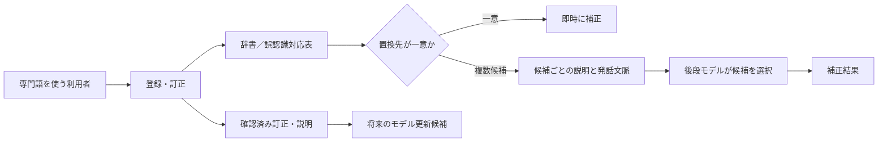

# 使用するほど賢くなる専門用語対応ASR

## ブレスト資料

更新：2026-09-16  
対象：日本を主対象とし、海外公報を技術比較に使用した。  
目的：専門用語を使う利用者との対話を通じ、再学習を待たずに認識結果を改善し、必要なら後からASR本体の更新にもつなげる仕組みを検討する。

この資料は、これまでの調査とブレストを一つにまとめたもの。特許性は公報の請求項・本文を比較した途中評価であり、出願可否、権利範囲、他社権利の実施可否を確定する法的意見ではない。

---

## 1. 背景

音声認識に専門用語を対応させる方法は、大きく四つに分かれる。

| 層 | 変更するもの | 例 |
|---|---|---|
| 辞書・語彙 | 表記、読み、候補の優先度 | 用語を登録し、読めるようにする |
| 認識時の文脈 | 分野・場面・利用者に合う候補の選び方 | 部署、アプリ、会話内容に応じて候補を優先する |
| 認識後の補正 | ASRが出力した文字列 | 辞書・履歴・LLMで専門語へ書き換える |
| モデル更新 | 音声と文字の対応を表す学習済みパラメータ | 訂正や音声を学習データにして定期更新する |

今回の中心は三層目の**認識後補正**である。利用者が訂正・登録した情報をすぐ次回の補正に使い、モデル重みの更新は後から別途行えるようにする。

従来の単純な登録は、正解語を一語ずつ辞書に足す発想である。しかし、実際のASRは、異なる専門語を同じ一般語・同じ表記に潰すことがある。例えば正解語B1とB2を発音したとき、いずれもASRがAと返すと、後処理の対応は次の形になる。

```text
A → { B1, B2 }
```

このとき、`A → B1` の固定置換はB2の発話を誤補正し、後からB2を登録して上書きすると今度はB1を誤補正する。これはASRの信頼度やn-bestが拮抗しているかどうかとは別の問題で、**後処理用の置換先が一意に決まらない競合**である。

---

## 2. ここまでに得た全体像



調査から明らかになったことは次のとおりである。

- 辞書登録、訂正履歴、音素照合、候補提示、同音異義語の選択、文脈補正、LLM後処理、ユーザー固有語彙、再学習は、それぞれ既に多くの先行技術がある。
- 「人が訂正した結果を次回から使う」「専門語を話して登録する」「意味を質問する」「同音語を文脈で選ぶ」だけでは、発明の核にしにくい。
- 一方、実際のASRが生んだ**特定の競合**を起点に、区別に必要な情報だけを取得し、その候補集合だけの将来補正に使う連結は、現在の主な検討対象である。
- 「すぐ使う後処理」と「数か月ごとのASR本体更新」は分けて扱うべきである。後処理の改善は直ちに反映できるが、それだけでモデルが学習済みになるわけではない。

---

## 3. ブレストの経緯と評価

| 検討した方向 | 内容 | 現時点の扱い |
|---|---|---|
| UIでの訂正 | チャット画面で文字を直し、その結果を次回へ反映 | 基礎機能として既知。単独では弱い |
| 音声による訂正 | 「違う、終わるに沈む」のような説明発話で漢字・語を指定 | 漢字指定、訂正発話、候補選択は近い先行例が多い |
| 音素・MFA・再発話 | 正しい語を再発話してもらい、音素列や強制アラインメントで対応付ける | 訂正位置特定や語彙追加の先行例が多い。補助技術としては有用 |
| n-best・複数ASR・反復発音 | 誤認識の再現性を見て登録を確定する | 単独では既知。登録品質の実施形態候補 |
| 音声埋込みRAG | 誤った音声区間に近い過去訂正を検索し、候補を出す | 音声埋込み検索・名称登録が近い。主案からは外した |
| 部署・個人に応じたRAG | 部署・個人が使う語を優先する | 個人化・組織化・アプリ文脈は既知。主案の入力情報にはなり得る |
| 訂正理由を聞く | LLMが理由質問の要否を決め、回答を後処理へ使う | 自然言語説明を使う訂正、意味質問、メモリが近い。理由取得だけでは弱い |
| 用語の意味・用例を聞く | 不明語の意味を質問し、将来の解釈に使う | 意味質問・保存・競合時の文脈判断まで近接例がある |
| 発音して誤認識を再現し置換する | 専門語を発話し、ASR出力を正解語へ対応付ける | 直接近い先行例がある。主案の土台であって固有点にはしない |
| **置換先競合を解く** | 同一誤認識キーの複数正解語を残し、候補ごとの説明で選ぶ | **現在の主案** |

---

## 4. 現在の主案

### 名称案

**競合検出型・意味カード付き専門語後補正**

「意味カード」は説明のための呼称であり、特許請求の範囲でこの名称を使う必要はない。

### 解決したい課題

> 利用者が専門語を追加した結果、同一のASR出力に複数の正解語が対応し、固定的な置換規則では正しく補正できない。対象ASRで実際に観測された競合について、利用者しか知らない用法の違いを取得し、後続発話の補正に使えるようにする。

### 登録時

1. 利用者が正解表記B2を登録し、B2を発音する。
2. 対象ASRが発話を認識し、認識表記Aを返す。
3. Aに、異なる既登録語B1が対応しているかを調べる。
4. 対応していなければ、A→B2を通常の置換候補として記録する。
5. 対応していれば、B1とB2を区別するための意味・用例を利用者に尋ねる。
6. A→{B1, B2}という候補集合と、B1・B2それぞれの説明を保存する。

### 利用時

1. 後続発話を通常ASRで文字化する。
2. 認識結果にAがあれば、Aに対応する候補集合を取得する。
3. 候補が一つなら、必要に応じてその候補を補正候補にする。
4. 候補が複数なら、周辺文、会話文脈、候補ごとの意味・用例を後段の言語処理モデルへ与える。
5. モデルがB1、B2又は元のAを選び、対応箇所だけを補正する。

### 最小のデータ構造

| データ | 内容 |
|---|---|
| 誤認識キー | 対象ASRが実際に返した表記A。完全一致又は明示した正規化後一致で検索する |
| 候補集合 | Aに対応する正解語IDの集合 `{B1, B2, …}` |
| 候補カード | 正解表記、意味、使用例、登録時の説明、確認元、版 |
| 登録根拠 | 登録発話、対象ASR、取得日時など。モデル更新の候補選定にも使える |

意味・用例を全登録語についてRAG検索する必要はない。まず誤認識キーで候補集合を限定し、その候補の説明だけを読む。これは、LLMに渡す情報量と処理時間を抑える設計上の利点になり得る。

### より焦点を絞った補強案

一般的に「この語は何ですか」と尋ねるのではなく、競合を検出した場合にだけ、**候補間の違いを答えさせる質問**をする。

例：

> 「B1とB2は、どの対象・状態・操作のときに使い分けますか。各語を使う短い例文を一つずつ教えてください。」

この質問は、用語の百科事典的な定義を集めるためではなく、将来のB1/B2の選択に必要な証拠を得るためのものと位置付ける。

---

## 5. 技術的な合理性

### 固定置換では避けられない誤り

一つのキーAからB1とB2が生じる場合、固定的にB1を返す方式は、B2を意味する発話を必ず誤補正する。B1とB2の出現比率をp対1-pとすれば、二候補だけの場合の最良の固定置換でも誤り率は少なくとも`min(p, 1-p)`となる。これは論理的な下限であって、実測値ではない。

候補ごとの意味・用例と現在の文脈がB1/B2を区別できれば、この誤りを減らせる可能性がある。特に社内略語、固有の工程名、同じ読みを持つ専門語では、一般的な言語モデルが持たない使い分けを補える余地がある。

### 登録時に競合を検出する意味

競合しない用語まで一律に質問すると、利用者負担と保存情報が増える。競合を検出してから質問するなら、質問対象は「対象ASRが同じ表記に変換した語の組」に絞られる。取得した説明も、将来その競合が再び出たときにだけ使える。

### 即時補正とモデル更新を分ける意味

対応表・候補カードは、再学習なしに更新できる。一方、定期的なASR本体更新には、正しい表記ラベル、音声との対応、品質評価が必要である。後処理がうまく動くことと、学習データとして安全であることは別に検証する。

### 効果の限界

- 現在の文脈でも候補を区別できない場合は解けない。
- 説明が不正確なら誤補正を増やし得る。
- ASRを更新すると、登録時の誤認識キーAが後で出なくなることがある。
- Aそのものが正しい一般語として使われる場合があるため、必ず置換する設計にはしない。

---

## 6. 特許性の暫定評価

### 現在の結論

出願候補として深掘りする価値はある。ただし、広い「誤認識表記→複数候補→文脈で選ぶ」「意味を聞いて保存する」だけでは進歩性を主張しにくい。現時点で単一文献が主案の全工程を開示するとまでは確認していないが、これは新規性ありの証明ではない。

主な争点は**進歩性**である。先行技術の要素を並べたときに、なぜ当業者が「実ASRで観測した競合を検出し、その競合を区別する説明を取得し、同じ候補集合の将来補正に再利用する」処理へ至るのか、またその処理でどの効果が得られるのかを具体的に示す必要がある。

### 主案の差分候補

| 要素 | 特許性を検討する上での意味 |
|---|---|
| 実発話から得たASR出力をキーにする | 抽象的な同音語群でなく、対象ASR・対象利用者で実際に起きる競合を対象化する |
| 異なる正解語を上書きせず候補集合として保持する | 新語の登録で既登録語の補正を壊す問題に対応する |
| 競合の検出に応じ、候補間を区別する説明を取得する | 質問対象と保存情報の利用範囲を、同じ競合集合で結び付ける |
| その説明を将来の同じ競合集合の選択に使う | 汎用的な用語知識でなく、実際に衝突した置換の選択根拠として使う |
| 競合候補だけに後段処理を適用する | 全発話の再処理ではなく、必要な対象を限定する |

### 想定される拒絶の論理

| 起点となる文献 | 組み合わされ得る技術 | 想定される指摘 |
|---|---|---|
| JP2022526467A | US20090254819A1、US20250335933A1 | 実発話による誤認識対応表へ、文脈選択と定義取得を加えただけ |
| JP7414078B2 | 同音語の文脈選択技術 | 辞書作成時に競合を検出するなら、利用時に選ぶ設計も容易 |
| US20220392432A1 | 個人文脈・訂正履歴による二段再順位付け | 登録説明を個人用情報として使うのは周知の個人化 |
| US5754977A | 対話による情報取得技術 | 登録時に競合を検出して利用者に対応を求めることは既知 |

### 出願に向けて強めるべき点

1. 「意味を保存する」ではなく、**競合する候補のどちらを選ぶ根拠としてどの情報を取得・保存・投入するか**を明確にする。
2. 仮想例だけでなく、実際に同じASR出力を返す異なる専門語の組を収集する。
3. 説明なし、通常文脈のみ、候補別説明ありを同じ音声・同じ後段モデルで比較する。
4. 新語B2の追加後も既登録語B1の精度を保てるかを測る。
5. 主請求項を「登録発話から将来の置換選択まで」の連結に置き、競合時だけ説明を取得する処理、対比例文の取得、複数ASRや反復発話を従属項候補として分ける。

---

## 7. 近接特許：現在案との比較

| 文献 | 確認した内容 | 主案との関係 |
|---|---|---|
| [JP2022526467A／US20220270595A1](https://patents.google.com/patent/JP2022526467A/ja) | 専門語を話者が発音し、ASRの誤認識語を対応表に登録。頻度・品詞による条件もある | 実発話→誤認識対応表が直接近い。候補別の意味・用例を質問し、競合時に選ぶ一連は確認箇所で未確認 |
| [JP7414078B2](https://patents.google.com/patent/JP7414078B2/ja) | 一つの類似語が複数変換先に対応すると、優先度で一つへ割り当てる | 置換元競合を直接扱う。主案は候補を残して利用時に選ぶ |
| [US20090254819A1](https://patents.google.com/patent/US20090254819A1/en) | 一つの誤表記に複数正解を対応付け、候補別の文脈統計で選ぶ | 1対多の訂正辞書と文脈選択が強く近い。文字入力のスペル訂正で、実発話・対話説明とは異なる |
| [JP2025514770A](https://patents.google.com/patent/JP2025514770A/en) | 誤認識語と非一般用語のペア、文脈、ペア順位で後修正 | ペア辞書＋文脈後修正が近い。候補別のユーザー説明と競合集合への限定は確認箇所で未確認 |
| [US20250335933A1](https://patents.google.com/patent/US20250335933A1/en) | 不明語の定義を質問・保存し、矛盾する定義を文脈で区別する | 意味質問・保存・競合判断まで近い。ASR誤認識キーからの候補選択ではない |
| [US20260065907A1](https://patents.google.com/patent/US20260065907A1/en) | 自然言語の構造・文脈・意味説明と発音をLLM訂正に使う | ユーザー説明をASR訂正へ使う点が近い。全20項を確認済み。日本対応未確認 |
| [US20220392432A1](https://patents.justia.com/patent/20220392432) | 訂正履歴、個人クラス、アプリ文脈から候補を追加・再順位付け | 個人化された二段補正が近い。語義質問ではない |
| [US5754977A](https://patents.justia.com/patent/5754977) | 登録時に新旧の音声パターンの混同を検出し、保留・変更を促す | 競合検出と登録時対話は既知。主案は名称変更でなく説明取得と後段選択を行う |
| [JP7771015B2](https://patents.google.com/patent/JP7771015B2/ja) | 修正履歴、差分文字列、話題・時刻、後段訂正モデル更新 | 訂正履歴を後段モデル更新に使う日本の近接例 |
| [JP2025135075A](https://patents.google.com/patent/JP2025135075A/en) | 利用者固有語彙と認識結果をLLMへ与える後修正 | LLM後処理・ユーザー固有語彙は既知 |

---

## 8. 調査済み特許の体系

以下は、ブレストで再利用しやすいよう、内容確認を行った代表的な特許・公開公報を機能別に並べた一覧である。同一ファミリーや重複論点は一行にまとめた。全件の請求項・審査経過・現況を精査した一覧ではない。

### A. 専門語の登録、辞書、誤認識対応表

| 文献 | 概要 |
|---|---|
| [JP5366169B2](https://patents.google.com/patent/JP5366169B2/ja) | 訂正語に対応する音声区間の音素列を取得して語彙登録 |
| [JP6718182B1](https://patents.google.com/patent/JP6718182B1/ja) | 入力語を音声化して得た誤解析語と対応付け、後で正しい候補を得る |
| [JP2022526467A](https://patents.google.com/patent/JP2022526467A/ja) | 実発話から専門語と誤認識語の対応表を作る |
| [JP2018045001A](https://patents.google.com/patent/JP2018045001A/en) | 話題ごとの誤認識置換表と閾値 |
| [JP7414078B2](https://patents.google.com/patent/JP7414078B2/ja) | 同音・類音語が複数変換先に対応する競合を優先度で一つへ解消 |
| [JP4816409B2](https://patents.google.com/patent/JP4816409B2/ja) | 音素分類と頻度による呼称登録 |
| [JP2009204732A](https://patents.google.com/patent/JP2009204732A/ja) | 文書検索で未知語の読み候補を検証 |
| [JP6869835B2](https://patents.google.com/patent/JP6869835B2/ja) | サーバ側の表記と端末側の読みを照合して登録 |
| [US20150106100A1](https://patents.google.com/patent/US20150106100A1/en) | 音響的混同度と新語追加が既存語へ与える影響を評価 |
| [US5754977A](https://patents.justia.com/patent/5754977) | 新規登録語が既存語と混同するかを登録時に検出 |

### B. 訂正対話、訂正位置の特定、音素照合

| 文献 | 概要 |
|---|---|
| [JP4604178B2](https://patents.google.com/patent/JP4604178B2/ja) | 対話による候補選択・保存・適応 |
| [JP3718088B2](https://patents.google.com/patent/JP3718088B2/ja) | 訂正用音声から候補生成・選択、辞書更新 |
| [JP4270770B2](https://patents.google.com/patent/JP4270770B2/ja) | 1回目の誤認識と訂正用再発話を音響対応付けして置換 |
| [JP4537755B2](https://patents.google.com/patent/JP4537755B2/ja) | 対話履歴から訂正発話を検出し直前発話を修正 |
| [JP2001306091A](https://patents.google.com/patent/JP2001306091A/ja) | 訂正用の再発話と元発話区間を対応付け |
| [WO2003025904A1](https://patents.google.com/patent/WO2003025904A1/en) | 訂正語の音素列で認識結果中の訂正位置を特定 |
| [US9514743B2](https://patents.google.com/patent/US9514743B2/en) | 訂正要求発話の検出と訂正候補生成 |
| [US20050203751A1](https://patents.google.com/patent/US20050203751A1) | OOV訂正、音素アラインメント、語彙追加 |
| [US20210005204A1](https://patents.google.com/patent/US20210005204A1) | 誤認識／正しい音素列の履歴と候補検索 |
| [US20210043196A1](https://patents.google.com/patent/US20210043196A1/en) | 音素記号列を辞書語へ置換 |

### C. 訂正履歴、RAG、LLM、個人化された後補正

| 文献 | 概要 |
|---|---|
| [JP7771015B2](https://patents.google.com/patent/JP7771015B2/ja) | 修正前後・話題・時刻の履歴を使う後段訂正モデル更新 |
| [JP2025135075A](https://patents.google.com/patent/JP2025135075A/en) | 利用者固有語彙をLLMへ与える後補正 |
| [JP2008243080A](https://patents.google.com/patent/JP2008243080A/ja) | 類似用例、音韻・意味属性を使う認識訂正 |
| [US10522133B2](https://patents.google.com/patent/US10522133B2/en) | 過去の誤認識・訂正履歴に基づく自動訂正又は警告 |
| [US9858038B2](https://patents.google.com/patent/US9858038B2/en) | 個人・集約利用者の置換データに基づく訂正候補 |
| [US20210142789A1](https://patents.google.com/patent/US20210142789A1/en) | 低信頼領域を文脈・音韻・埋込み等で置換 |
| [US20220392432A1](https://patents.justia.com/patent/20220392432) | 訂正ログ、個人情報、アプリ文脈で候補を再順位付け |
| [US20230402034A1](https://patents.google.com/patent/US20230402034A1/en) | 過去の利用者訂正を代替仮説へ反映 |
| [US12444412B2](https://patents.google.com/patent/US12444412B2/en) | LLMが検索・ユーザー入力等を使うASRエンティティ訂正 |
| [US20260011325A1](https://patents.google.com/patent/US20260011325A1/en) | ASR仮説と文脈リストによる後段スペル訂正 |
| [WO2006113350A2](https://patents.google.com/patent/WO2006113350A2/en) | ASR出力と最終編集文書対で後段訂正モデルに適応 |

### D. 意味質問、同音異義語、漢字・自然言語説明による訂正

| 文献 | 概要 |
|---|---|
| [US20250335933A1](https://patents.google.com/patent/US20250335933A1/en) | 不明語の定義を質問・保存し、定義の競合を文脈で解く |
| [US10621285B2／US20200034423A1](https://patents.google.com/patent/US10621285B2/en) | 語義を質問して意味表現・知識を更新 |
| [JP7178995B2](https://patents.google.com/patent/JP7178995B2/ja) | 上記に対応する日本同族。質問・知識更新・後続利用 |
| [JPH075891A／JP3397372B2](https://patents.google.com/patent/JPH075891A/ja) | 質問回答で認識語彙を変更し元音声を再評価 |
| [JP2013250931A](https://patents.google.com/patent/JP2013250931A/ja) | 意味不明な認識語について他利用者に質問し回答を取得 |
| [JP2002287787A](https://patents.google.com/patent/JP2002287787A/ja) | 同音異義文字、説明語、文字列・語句・文脈キュー |
| [JP5819924B2](https://patents.google.com/patent/JP5819924B2/ja) | 日本語の単語内文字による訂正時の語彙構築 |
| [JP5622566B2](https://patents.google.com/patent/JP5622566B2/ja) | 発声による文字指定、訂正、レキシコン更新 |
| [JPWO2014041607A1](https://patents.google.com/patent/JPWO2014041607A1/en) | 同音・異表記候補の表示と利用者選択による置換 |
| [JP3710157B2](https://patents.google.com/patent/JP3710157B2/ja) | 読みと漢字構成要素を併用する語句入力 |
| [US20260065907A1](https://patents.google.com/patent/US20260065907A1/en) | 発音、構造・文脈・意味の自然言語説明を用いるLLM訂正 |
| [CN115019787B](https://patents.google.com/patent/CN115019787B/en) | 拮抗する同音候補を説明語彙・言語モデルで提示・選択 |

### E. 音響検索、同音候補、分野・利用者文脈

| 文献 | 概要 |
|---|---|
| [US12444402B2](https://patents.google.com/patent/US12444402B2/en) | 音声埋込みで固有名詞候補を検索し、選択結果を登録 |
| [US9558740B1](https://patents.google.com/patent/US9558740B1/en) | 曖昧性解消の必要性を判定してから候補を選ぶ二段処理 |
| [US8600760B2](https://patents.google.com/patent/US8600760B2/en) | n-bestの第一候補が混同しやすい場合に第二候補を採用 |
| [US12633290B2](https://patents.google.com/patent/US12633290B2/en) | 音素候補と分野・利用者意図で認識文を順位付け |
| [JP7322782B2](https://patents.google.com/patent/JP7322782B2/ja) | 音声住所の同音誤変換を地域情報で補正 |
| [JP6233867B2](https://patents.google.com/patent/JP6233867B2/ja) | 付加情報に一致する語の確率を優先 |
| [US8204739B2](https://patents.google.com/patent/US8204739B2/en) | 利用者コミュニティの訂正・新語共有と確率調整 |
| [US8532994B2](https://patents.google.com/patent/US8532994B2/en) | 本人・ソーシャルグラフ由来語彙で個人化 |
| [JP6488588B2](https://patents.google.com/patent/JP6488588B2/ja) | ソーシャルグラフのデータを連絡先語彙へ利用 |

### F. 学習データ作成、モデル更新、評価・撤回

| 文献 | 概要 |
|---|---|
| [JP4657736B2／US8019602B2](https://patents.google.com/patent/JP4657736B2/ja) | 文字変更が訂正か編集かを推論し、選択的に学習 |
| [JP7146038B2](https://patents.google.com/patent/JP7146038B2/ja) | 複数の書き起こしと事後確率を利用する更新 |
| [JP7104247B2](https://patents.google.com/patent/JP7104247B2/ja) | 文字を合成音声化して認識モデル更新に使う |
| [JP7858433B2](https://patents.google.com/patent/JP7858433B2/ja) | 疑似認識で誤りやすい表現を抽出し学習コーパスを選択 |
| [JP2012108429A](https://patents.google.com/patent/JP2012108429A/ja) | 認識器間の一致度等で学習対象音声を選別 |
| [JP6526608B2](https://patents.google.com/patent/JP6526608B2/ja) | 語彙登録前後の変化例を表示して副作用を評価 |
| [JP5921601B2](https://patents.google.com/patent/JP5921601B2/ja) | 過去に除外した候補を次回候補から除く |
| [WO2023113422A1](https://patents.google.com/patent/WO2023113422A1/en) | 検証失敗時に適応前モデルへ切替・リセット |
| [US8280733B2](https://patents.google.com/patent/US8280733B2/en) | 訂正か意図変更かを分類し、選択的に語彙へ追加 |
| [US8977547B2](https://patents.google.com/patent/US8977547B2/en) | 複数発話の安定性で登録可否・再発話を制御 |
| [US20190035385A1](https://patents.google.com/patent/US20190035385A1) | 正誤入力、訂正、n-best候補、訂正による学習 |

---

## 9. 出願検討用の請求項の方向

### 独立請求項の骨格案

1. 登録対象語の正解表記を得る。
2. 利用者の登録発話をASRに入力し、認識文字列を得る。
3. 認識文字列をキーとして、正解表記を一又は複数記憶する。
4. 対話で得た候補語の意味又は使用例を、候補語に関連付けて記憶する。
5. 後続発話にキーが現れ、対応する相異なる候補語が複数ある場合、その候補語の情報と後続発話の文脈を言語処理モデルに入力する。
6. 選ばれた候補語で対応箇所を補正する。

### 従属項の候補

- 新語の登録時に、同じキーに既登録語が対応していることを検出してから質問する。
- 質問が、候補語それぞれを使う対象・状態・操作又は対比例文を求める。
- 一候補のキーでは後段モデルを呼び出さない。
- 複数ASR、複数デコード条件又は複数回発話で得たキーを同じ候補語に対応付ける。
- 登録根拠を定期的なASRモデル更新の学習候補に用いる。

これは検討用の骨格であり、権利化範囲を確定した文案ではない。

---

## 10. 効果を確認するための試験計画

実験はまだ行っていない。出願時にどこまでデータが必要かは別として、主案の合理性を裏付けるには次の比較が有効である。

| 条件 | 内容 |
|---|---|
| A | 通常ASRのみ |
| B | 一候補へ固定置換 |
| C | 複数候補と現在文脈だけで選択 |
| D | Cに候補別の登録説明を加える |
| E | Dを競合キーだけで実行する |

測る項目は、候補集合に正解が含まれる割合、候補集合内での選択正解率、全体の専門語正解率、正しい一般語を壊す率、B2追加後のB1精度、質問数、モデル呼出し率、遅延、LLM入力量である。

特に、説明なしと説明ありを比較し、候補別の説明を入れ替えた対照も置く。説明が実際に候補選択へ寄与しているかを確認するためである。一般語だけでなく、言語モデルが十分に知らない社内略語や独自用法も別に評価する。

---

## 11. 次のブレストで詰める論点

1. 「意味」とは何を保存するか。定義、用例、対象物、操作、禁止される用法、対比例文のどれが最も候補選択に効くか。
2. 利用者に何をどう質問すれば、B1/B2の区別に必要な説明を少ない負担で取得できるか。
3. 元の認識表記Aを残すべき場合を、どのように候補に含めるか。
4. 候補選択をLLMに任せる範囲と、辞書・分類器・ルールで決める範囲をどう分けるか。
5. 個人の説明を部署へ共有するか。共有するなら、どの根拠・確認・例外条件が必要か。
6. 即時後補正に使える情報と、定期的なモデル更新に使える情報をどう区別するか。
7. 対象ASRを更新したときに、既存の誤認識キーをどう再検証するか。

---

## 12. 調査の限界と詳細資料

- 本資料の先行技術比較は、Google Patents、Justia等で取得した公開・登録公報の請求項又は本文に基づく。公式の審査経過、補正後の全権利範囲、全ファミリー、非特許文献、分類からの網羅検索は未完了である。
- 「確認箇所で未確認」は、公報全体や世界中の技術に存在しないことを意味しない。
- 日本中心の調査だが、海外文献は日本での新規性・進歩性検討の参考になる。一方、海外での権利状態と日本での権利状態は別に確認する必要がある。
- 個別の確認範囲、根拠箇所、修正履歴は[近接先行技術索引](PRIOR_ART_INDEX.md)と[引き継ぎ](HANDOFF.md)にある。現在の主案の詳細は[第47回](2026-09-16_47_collision-mapping-prior-art.md)、出願候補の骨格・反論・試験計画は[第48回](2026-09-16_48_invention-framework-and-patentability.md)を参照。
