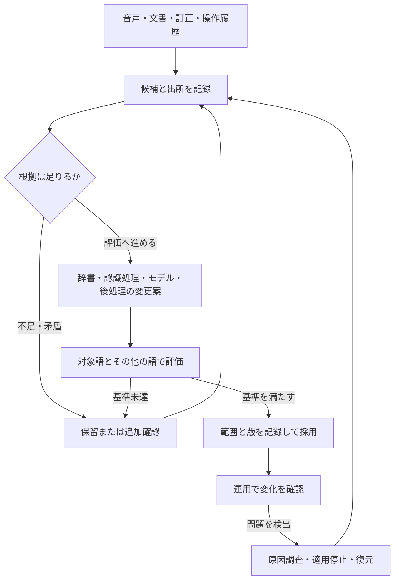

# 専門用語に対応する音声認識の特許全体像

## 1. 結論

専門用語への後付け対応には、語と読みを辞書に追加する方式、文脈に応じて語を出やすくする方式、学習データを作ってモデルを更新する方式、認識後の文章を訂正する方式がある。日本の公報には、通常の訂正から学ぶ方法、文書からの用語収集、未ラベル音声によるモデル適応、合成音声による追加学習まで記載されている。[^1][^2][^3][^4][^5]

改善を自動化する際の管理も比較対象になる。登録の副作用を表示する、判断の難しい音声を学習対象として選ぶ、運用時に適応前モデルへ切り替える、といった記載がある。ただし最後の例は海外公報であり、日本対応は未確認である。[^6][^7][^8]

したがって、現時点の分析では「専門用語を自動で学習する」「訂正を次回に反映する」「悪化を防ぐ」という目的だけを新しい発明の根拠にはできない。次に具体化すべきなのは、正しさの根拠、更新の単位、採用・保留の条件、失敗後の処理を組み合わせた仕組みと、その効果である。これは新規性や進歩性についての確定判断ではない。

## 2. 最初に区別する4つの方式

ここでいう「モデルをアップデートする」は、次の4方式を含む広い意味で扱う。実際の製品では複数を組み合わせられる。

| 方式 | 何を変えるか | 具体的な比較例 | 誤解しやすい点 |
|---|---|---|---|
| 辞書・語の優先度 | 表記、読み、語の出やすさ | 訂正箇所の音声から発音を取り出して追加[^1] | 辞書追加とニューラルモデルの再学習は別 |
| 認識時の文脈・言語モデル | 分野や場面に応じた候補の選び方 | 付加情報が一致する語の確率を上げる[^9] | 場面に合う語が実際に発話されたとは限らない |
| 音声認識モデルの追加学習 | 音声と文字の対応を扱う学習パラメータ | 未ラベル音声からの適応、文字から作る合成音声での学習[^3][^4] | 学習データの生成と正解の保証は別 |
| 認識後の訂正 | すでに出た文字列 | ユーザー関連語をLLMに渡して訂正[^5] | 出力が改善しても元の認識モデルが学習したとは限らない |

「辞書登録を人に頼まない」ことにも段階がある。通常の文字訂正だけを利用する方式、業務文書から自動的に候補を得る方式、難しい対象だけ人に確認する方式、正解入力を必須としない学習方式を別々に比較する必要がある。[^1][^2][^3][^7]

## 3. 改善の工程と代表公報

### 3.1 語と読みを見つける

| 工程 | 公報と根拠位置 | 確認した技術 | 残る比較事項 |
|---|---|---|---|
| 訂正から語・発音を得る | JP5366169B2、登録1・2[^1] | 訂正語に対応する音声区間の音素列を取得して登録。未訂正部分を再認識 | 人の文字訂正が必要 |
| 文書から読み候補を検証 | JP2009204732A、公開1・3・4[^10] | 未登録語の読み候補と表記の組を文書検索し、文書数等で選択 | 社内固有の読みが外部文書にない場合 |
| 文書から学習材料を集める | JP7858433B2、登録1[^2] | 疑似認識で誤りやすい表現を抽出し、含有テキストからコーパスを選択 | 文書の正確性と、実音声での誤りの一致 |
| 二つの認識器を組み合わせる | JP6869835B2、登録1・2・7[^11] | サーバ側の表記と端末側の読みを形態素単位で照合し登録 | 表記一致は真の正解の保証ではない |
| 呼び方の変化を蓄積する | JP4816409B2、登録1・7・9[^12] | 音素による分類と頻度を用いた呼称登録。確認や追加・削除閾値の従属項 | 正しい別称と誤認識をどう区別するか |

### 3.2 学習に使う根拠を選ぶ

| 根拠 | 公報と根拠位置 | 確認した技術 | 読み取れないこと |
|---|---|---|---|
| 人による文字変更 | JP4657736B2、登録1・8～11[^13] | 訂正と文章編集を推論で区別し選択的に学習 | 変更が常に正しい訂正という保証 |
| 普段の操作 | JP3896099B2、明細書【0030】～【0036】[^14] | 番組の選択・録画設定・中断から、仮頻度を確定または取消 | 中断が必ず誤認識を意味するという保証 |
| 認識器間の不一致 | JP2012108429A、公開1～6[^7] | 対象モデルと他モデルの一致度等で学習対象音声を選別 | 不一致だけで正解文字が決まること |
| 元データと変形データの不一致 | JP7293498B2、登録1[^15] | 不一致が大きい対象を優先して正解ラベルを取得し学習 | 音声認識専用の技術という限定 |
| 正解入力のない発話 | JP7146038B2、登録1[^3] | 異なる二つの書き起こしと事後確率に基づく損失で更新 | 二つの書き起こしのどちらかが必ず正解であること |
| 過去の除外判断 | JP5921601B2、登録1[^16] | 除外語と一致・類似する候補を除き、運用者の判断を次回へ保存 | 登録後の悪化を検出して巻き戻すこと |

上表の「読み取れないこと」は、指定箇所からの要約の限界であり、関連する技術が世の中に存在しないという主張ではない。

### 3.3 更新し、評価し、運用する

| 工程 | 公報と根拠位置 | 確認した技術 | 区別する事項 |
|---|---|---|---|
| 文字から学習音声を作る | JP7104247B2、登録1[^4] | 端末内の文字を合成音声化し、認識文字との比較からモデル更新 | 合成音声での一致と実発話の改善 |
| 場面に応じて語を優先 | JP6233867B2、登録1・2[^9] | 認識結果と付加情報を辞書へ反映し、状況一致の語を優先 | 利用者・場面ごとの適応と無条件の全員共有 |
| 登録の副作用を見る | JP6526608B2、登録1～3[^6] | 登録前後の変化例を表示。候補語を含まない例を優先表示 | 人の採用選択と全自動の採否判定 |
| 切替前にモデルを評価 | JP7104247B2、明細書[^4] | 学習に使わないデータで旧・新モデルを比較する例 | 登録1の必須条件ではない |
| 運用時に元へ切替 | WO2023113422A1、公開11～13[^8] | 適応部のリセット、検証失敗時に元モデルの予測を利用 | 任意の過去版や原因語だけの復元とは異なる |
| 分野別モデルを統合 | US20240290319A1、公開1～3[^17] | 分野別に並行学習したモデルのパラメータを平均 | 旧分野の性能維持を製品で実証したという意味ではない |
| 固有語を別経路で扱う | WO2024124697A1、公開1・3[^18] | 固有語の種類ラベルと音声区間から辞書等で具体語を復元し、新語を追加 | 追加語ごとのモデル本体再学習とは異なる |
| 認識後に訂正する | JP2025135075A、公開1・5・6[^5] | LLMへ関連語と認識結果を渡し、必要性判断に応じて訂正 | LLMの判断を学習用の真の正解とみなすこと |

各行は請求項の全構成要件を列挙していない。工程の地図を作るための要約である。

## 4. 請求項を読む際の重要な違い

### 公開時と登録時の違い

JP2024001922Aの公開請求項1は、分野の特有表現の抽出、含有テキストの収集、基準に合うデータの選択を記す。対応するJP7858433B2の登録請求項1では、読み仮名列から疑似認識結果を推定し、原文との差分から誤認識指標を作って表現抽出に用いる条件が含まれる。単に「専門文書から文章を集める特許」とだけ把握すると、登録条件を見落とす。[^2][^19]

JP6107003B2でも、登録請求項1には雛形との差分を利用する条件がある。利用者文書を使う方式を検討するときには、文書全体を処理するのか、雛形から利用者が変えた部分を処理するのかを分けて比較する。[^20]

### 日本と海外の違い

JP4657736B2とUS8019602B2は対応出願だが、登録請求項の条件は同一ではない。例えば特定の信頼性計算式は、日本では従属請求項3、米国では独立請求項1に記載されている。海外の独立項を日本にそのまま当てはめることはできない。[^13][^21]

### 独立項・従属項・実施例の違い

従属項は引用する請求項の条件に追加条件を付ける。ある従属項で確認した評価や閾値を、別の請求項にも当然に必須としない。明細書の実施例は技術の理解に役立つが、実施例の全工程が独立項の必須条件とは限らない。特許庁も、技術的範囲は各請求項の記載に基づいて定められる旨を説明している。[^22]

本資料は構成の比較を行うもので、個別の実装が特許権の範囲に入るかを判定するものではない。

## 5. 自動改善を検討するための枠組み

以下は公報の引用ではなく、上記比較に基づく設計・監査用の提案である。新規性を確認した発明案ではない。

### 5.1 候補と採用済みの知識を分ける

改善の候補には、表記・読みだけでなく、どの文書や音声から得たか、いつ得たか、誰または何が確認したか、どの場面で有効かを付ける。候補の発見と採用を別の判断にすることで、誤った認識結果がそのまま次回の学習データになる経路を監査しやすくする。

候補の状態は「未確認」「追加確認が必要」「評価待ち」「採用」「除外」「撤回」などで表す。同じ語でも、ある部署では採用、別の部署では未確認という扱いを許すかを決める。語の正誤と適用範囲の正しさを分けるためである。

この図は複数の公報から得た比較軸を用いた検討用の流れで、単一公報の図の再現ではない。

### 5.2 評価は一つの総合点にまとめすぎない

| 評価の対象 | 確かめたいこと | 記録する例 |
|---|---|---|
| 新たな専門語 | 狙った語を本当に認識できるか | 正しい表記の割合、読み・略称別の誤り |
| 紛らわしい一般語 | 専門語へ誤って置換しないか | 対象語が発話されていない音声での誤置換 |
| 既存の専門語 | 新語への対応で以前の語が悪化しないか | 更新前から存在する語群の成績 |
| 別の部署・話者 | 適用範囲を広げても問題ないか | 部署・話者・利用場面ごとの成績 |
| 自動化の負担 | 精度と確認作業量が見合うか | 確認件数、保留件数、訂正回数 |
| 復元の実効性 | 問題の影響を取り除けるか | 停止対象の特定、復元後の再評価 |

採否の数値は、対象業務と実音声データを見て設定する。実験なしに「この閾値なら安全」「一般語が悪化しない」とは決めない。まず既存の認識結果、辞書等による変更結果、必要ならモデル学習後の結果を同じ評価データで比べられるようにする。

## 6. 今後の発明検討で具体化する5つの問い

下表の右列は未確認の組合せや効果を調べるための課題であり、特許上の空白の一覧ではない。

| 問い | すでに比較すべき先行例 | 次に具体化する条件 |
|---|---|---|
| 複数の根拠が矛盾したらどうするか | 訂正／編集の推論[^13]、外部判定[^14]、認識器間一致度[^7] | 文書・音声・ユーザー操作のどれを、どの場面で優先し、いつ保留するか |
| 滅多に出ない重要語をどう扱うか | 低頻度語の重要度設定[^23]、対象語彙の拡大・縮小[^24] | 頻度と業務上の損失を別に扱い、評価例が少ない状態で何を根拠に採用するか |
| 誤った更新だけを取り消せるか | 適応部リセット・元モデルへの切替[^8]、除外履歴[^16] | 原因候補・学習データ・配布先を結び、他の改善を残したまま撤回できる単位と検証方法 |
| 個人の改善を他の人へ広げられるか | 付加情報に応じた優先[^9]、個人適応と遠隔集約[^25] | 個人→部署→全体へ進める証拠、同音異義語の衝突、例外の扱い |
| モデル更新を選ぶ必要があるか | 文書コーパス[^2]、合成音声学習[^4]、LLM訂正[^5] | 語の誤りの原因、必要なデータ、計算量、改善の持続性を比べて更新対象を選ぶ基準 |

検討を始めやすいのは「通常の訂正・文書・音声から候補を得て、根拠不足なら保留し、副作用を評価して限られた範囲へ適用する」流れである。ただし、これを組み合わせただけで特許になるという意味ではない。差を主張するには、具体的な入力・処理・出力と比較実験が必要になる。

候補発明の記述は「何を自動化したいか」から一段進め、「どの入力に対し、どの判定を行い、どの状態を更新し、従来方法と比べて何が変わるか」という形にする。その段階で、近い公報の請求項全体、引用文献、審査経過を比較する。

## 7. 調査の範囲と確かさ

初版基準日は2026年9月14日、追加確認は9月15日。日本の公開・登録公報を中心に、海外の対応出願と技術例を参照した。音声認識の辞書登録、文書適応、訂正学習、未ラベル学習、合成音声、評価、運用時切替、共有、忘却対策を対象とする第一段階の技術地図である。

根拠の多くはGoogle Patentsに掲載された公報本文・請求項である。一部の日本語ページは取得できず、英語ページの日本語併記を参照した。海外文献は英語または機械翻訳を参照した。新規性を判断する際に必要となる非特許文献の体系的調査、特許分類からの全件抽出、全ファミリーの整理は実施していない。

| 確認の種類 | 状況 |
|---|---|
| 主要工程の代表公報と根拠位置 | 本文・比較表・出典に整理済み |
| 公開／登録の主要な条件差 | JP7858433B2、JP6107003B2等で確認。全件全項の照合ではない |
| 日本対応 | JP4657736B2、JP2025135075Aを特定。海外全件は未完了 |
| 公式な状態表示 | 既確認分はJP6233867B2が有効、JP6150268B2・JP6107003B2が年金不納による消滅、JP2000259172Aがみなし取下げ。9月15日にJP7858433B2・JP7104247B2の有効、JP2025135075Aの審査請求前を追加確認。固定リンクは第12回メモ。確認時点の表示であり登録原簿の精査ではない |
| その他の権利現況 | GoogleのActive／Pending等を確定判断に使っていない |
| 審査経過 | 拒絶理由・補正理由・審判書類の本文精査は未完了 |
| 未公開出願・検索漏れ | 把握できないものを含む。公報未発見から権利不存在を結論しない |
| 特許取得可能性・実施可否 | 未判定。具体的な発明または実装の確定後に別途比較する |

忘却対策や履歴管理には、一般的な機械学習の日本公報もある。例えば、過去モデルの評価と履歴から追加学習データを選ぶJP2025139756A、過去データを要約して学習データを生成するJP2024131342Aである。音声認識を主要実施例とする文献と混同せず、周辺技術として扱う。[^26][^27]

## 8. 出典

番号は本資料内の参照番号。日本の公報は日本国特許庁発行公報のGoogle Patents掲載版。各リンクの請求項・明細書の指定箇所を根拠とする。書誌の日付をすべて公式記録と再照合したものではない。

**9月15日の追加確認**：[第12回](2026-09-15_12_official-status-and-framework.md)に、文書選別JP6004452B2、行動に応じた更新抑止US6374221B1、訂正から合成音で再学習するWO2024111387A1／日本A5、ASRの誤学習データ選別US20260155138A1、一般MLの学習解除US20260170341A1を追加した。特に最後の2件は「原因単位の撤回」に近い開示を含むため、本資料の検討課題を空白と読まない。[枠組み比較](FRAMEWORK_REVIEW.md)は、この追加確認を反映した設計仮説と試験計画である。米国2件はJustia掲載Claimsで確認、米国公式照合・日本対応は未確認。

[^1]: [JP5366169B2](https://patents.google.com/patent/JP5366169B2/ja)、登録請求項1・2。訂正と発音の辞書登録。
[^2]: 東芝、[JP7858433B2「情報処理システム、情報処理方法およびプログラム」](https://patents.google.com/patent/JP7858433B2/en)、2026-05-14、登録請求項1。
[^3]: 東芝、[JP7146038B2](https://patents.google.com/patent/JP7146038B2/ja)、登録請求項1。未ラベル発話によるモデル適応。
[^4]: Google、[JP7104247B2](https://patents.google.com/patent/JP7104247B2/en)、登録請求項1・6・7・11～13、明細書の学習外データによる評価・切替の段落。
[^5]: リコー、[JP2025135075A「情報処理システム、音声認識システム、情報処理方法、及びプログラム」](https://patents.google.com/patent/JP2025135075A/en)、2025-09-18、公開請求項1・5・6。対応WO2025186658A1。
[^6]: [JP6526608B2「辞書更新装置およびプログラム」](https://patents.google.com/patent/JP6526608B2/en)、登録請求項1～3。
[^7]: NEC、[JP2012108429A「音声選択装置、発話選択装置、音声選択システム、音声選択方法および音声選択プログラム」](https://patents.google.com/patent/JP2012108429A/en)、2012-06-07、公開請求項1～6。
[^8]: Samsung、[WO2023113422A1 “Method and apparatus for adapting a local ML model”](https://patents.google.com/patent/WO2023113422A1/en)、公開請求項11～13、音声認識を含む明細書。
[^9]: NEC、[JP6233867B2「音声認識用辞書登録システム、音声認識システム、音声認識サービスシステム、方法およびプログラム」](https://patents.google.com/patent/JP6233867B2/ja)、登録請求項1・2。
[^10]: [JP2009204732A](https://patents.google.com/patent/JP2009204732A/ja)、公開請求項1・3・4。文書による読み候補選択。
[^11]: [JP6869835B2](https://patents.google.com/patent/JP6869835B2/ja)、登録請求項1・2・7。サーバと端末の認識情報による登録。
[^12]: [JP4816409B2「認識辞書システムおよびその更新方法」](https://patents.google.com/patent/JP4816409B2/ja)、登録請求項1・7・9。
[^13]: Microsoft、[JP4657736B2](https://patents.google.com/patent/JP4657736B2/en)、登録請求項1・3・8～11。訂正と編集の区別。
[^14]: 東芝、[JP3896099B2「認識辞書編集装置、認識辞書編集方法、及びプログラム」](https://patents.google.com/patent/JP3896099B2/ja)、登録請求項1、明細書【0030】～【0036】。
[^15]: [JP7293498B2「サンプル一致度評価による能動学習」](https://patents.google.com/patent/JP7293498B2/en)、登録請求項1。
[^16]: [JP5921601B2](https://patents.google.com/patent/JP5921601B2/en)、登録請求項1。除外語の記憶と次回選別。
[^17]: [US20240290319A1 “Systems and methods for continual learning for end to-end automatic speech recognition”](https://patents.google.com/patent/US20240290319A1/en)、2024-08-29、公開請求項1～3。
[^18]: [WO2024124697A1 “Speech recognition method, apparatus and device, and storage medium”](https://patents.google.com/patent/WO2024124697A1/en)、2024-06-20、公開請求項1・3。中国語原文・英訳掲載。
[^19]: 東芝、[JP2024001922A](https://patents.google.com/patent/JP2024001922A/en)、2024-01-11、公開請求項1。
[^20]: NEC、[JP6107003B2](https://patents.google.com/patent/JP6107003B2/ja)、登録請求項1。雛形との差分から語の重みを変更。
[^21]: Microsoft、[US8019602B2 “Automatic speech recognition learning using user corrections”](https://patents.google.com/patent/US8019602B2/en)、登録請求項1。
[^22]: 特許庁、[特許・実用新案審査基準 第II部第2章「特許請求の範囲の記載要件」](https://www.jpo.go.jp/system/laws/rule/guideline/patent/tukujitu_kijun/ht/02_0200.html)。
[^23]: [JP7102986B2](https://patents.google.com/patent/JP7102986B2/en)、登録請求項1。低頻度語の重要度設定。
[^24]: [JP4767754B2](https://patents.google.com/patent/JP4767754B2/ja)、登録請求項1～3。保存語彙と認識対象の選別。
[^25]: [US9111540B2](https://patents.google.com/patent/US9111540B2/en)、請求項・明細書の個人適応、統計のフィルタ・集約・配布。
[^26]: Canon、[JP2025139756A「情報処理装置およびその制御方法」](https://patents.google.com/patent/JP2025139756A/en)、2025-09-29、公開請求項1。周辺技術。
[^27]: [JP2024131342A「情報処理装置、情報処理方法およびプログラム」](https://patents.google.com/patent/JP2024131342A/en)、公開請求項1。周辺技術。

## 別紙

[請求項の比較と監査順序](CLAIM_COMPARISON.md)／[全体像の短いまとめ](OVERVIEW.md)／[引き継ぎ](HANDOFF.md)。

